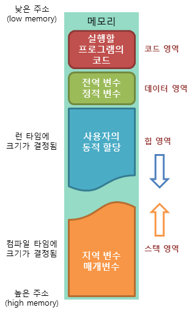

# Recruit
### 1. 유니티 엔진에서 가장 자신있는 부분과 가장 자신없는 부분은 무엇인가요?
코드를 깔끔하게 작성하는데 자신감이 있다고 생각합니다. 제 성격도 깔끔한 성격이기 때문에 스크립트 간의 커플링이나 스파게티 코드가 되지않도록 다양한 수단을 찾아 모듈화시키도록 노력하였습니다. OOP의 가장 기본적인 개념인 `인스턴스화`, `캡슐화`, `상속`, `추상화`, `다형성`의 개념을 최대한 활용하여 싱글톤 패턴, 팩토리 패턴, 오브젝트 풀링 패턴등을 활용하였습니다. 델리게이트, 이벤트를 활용한 핸들러 개념도 최대한 활용해보려 노력합니다.

컴퓨터 그래픽스 부분에서 아직 많이 부족한 것 같습니다. 한 때 툰쉐이딩이 어떤 것인가 파보기위해 구글링과 도서탐독을 하였고 유니티에서 지원하는 srp와 툰쉐이딩을 위한 블렌디드 쉐이딩의 개념들을 얼추 익혔습니다. 비주얼 노드 방식의 쉐이더 툴을 이용해보았지만, 진정으로 shader를 작성한다던가 하는 다양한 이펙트를 적용하기에는 무리가 있었습니다. 파티클 시스템보다는 보다 원초적이고 화려한 쉐이딩이펙트가 어떻게 작성되어지는지 지금까지 관심을 기울이고 있습니다.

<br>

### 2. 우리 회사에서 하고 싶은 일을 3가지 정도로 요약해 주세요.
1. 언플러그드 코딩교육의 요소를 게임에 잘 녹여서 게임성도 뒤떨어지지않는 교육컨텐츠를 개발해보고싶습니다.
2. 전시회에서도 많은 사람들이 참여할 수 있는 멀티컨텐츠, 서버프로그래밍도 도전해보고싶습니다.
3. VR컨텐츠의 상용화를 위해서 구글 카드보드를 사용해도 재미있는 모바일 VR 컨텐츠를 개발해보고 싶습니다.

<br>

### 3. C# 에서 static 키워드의 의미를 아는대로 말해 보세요.
- static 메서드는 인스턴스 객체로부터 호출될 수 없으며, 반드시 클래스명과 함께 사용된다.
- static 필드는 프로그램 실행 후 해당 클래스가 처음으로 사용될 때 한번 초기화되어 계속 동일한 메모리를 사용하게 된다.
- static 클래스는 객체를 생성할 수 없으므로 public 생성자(Constructor)를 가질 수 
- static 클래스는 static 생성자를 가질 수 있다. 이 static 생성자는 주로 static 필드들을 초기화 하는데 사용한다. 
- 정적 클래스에 대한 Type 정보는 클래스를 참조하는 프로그램이 로드될 때 .NET Framework CLR에 의해 로드됩니다. 
- 정적 생성자는 한 번만 호출되며, 프로그램이 있는 애플리케이션 도메인의 수명 동안 정적 클래스가 메모리에 유지됩니다.
- 주요 특징
  - 정적 멤버만 포함합니다.
  - 인스턴스화할 수 없습니다. (new 연산자를 사용할 수 없다.)
  - sealede되어 있습니다.
  - 인스턴스 생성자를 포함할 수 없습니다.



- 데이터(data) 영역
  - 메모리의 데이터(data) 영역은 프로그램의 전역 변수와 정적(static) 변수가 저장되는 영역입니다.
  - 데이터 영역은 프로그램의 시작과 함께 할당되며, 프로그램이 종료되면 소멸합니다.


<br>

### 4. 최근 재미있게 했던 게임중에 가장 구현하고 싶었던 부분은 무었이었나요? 유니티에서 구현한다면 뭐가 가장 필요한가요?


스팀게임 `sea of thieves`의 해상전투씬입니다. 위와 같이 바다와 같은 느낌은 어떻게 구현할까? https://www.youtube.com/watch?v=rowyqIkX7Pg 를 참고하여보니 쉐이더를 구현하여 작성한 것으로 보입니다. 아래는 제가 추측한 로직입니다.
- 바다오브젝트의 surface는 강도와 연관된 프로퍼티와 노이즈값을 통해 불규칙적인 모양의 파도를 만드는 것처럼 보입니다.
- 바다오브젝트의 surface가 한 곳으로 모이게되면 하얗게 변하여 파도를 표현한 것 같습니다.
- 바다오브젝트의 surface y축 아래로는 수면을 말하며, 빛이 물결모양 노이즈를 거쳐 수면아래 반사광을 비추도록 한 것처럼 보입니다.
- 바다오브젝트의 surface에 다른 물체가 닿으면, 닿은 면적만큼의 surface에 하얀 물결을 일렁이도록 한 것처럼 보입니다.
- 배가 바다오브젝트위에 올라갈때에는, 일렁이는 surface에 맞춰 배도 함께 일렁이는 것 처럼 보입니다.


<br>

### 5. 본인이 작성했던 메소드 중 매개변수의 수가 가장 많았던 것은 몇개였고 뭐하는 메소드 였나요?
```c#
public float ImpulseTagetToEnemy(transform t_dir, transform e_dir, float power){
... // 선택한 타겟 오브젝트를 Enemy 오브젝트를 향해 날라가듯 연출하였습니다. 
}
```
제 경우에는 보통 매개변수로 객체 또는 인터페이스를 업케스팅/다운케스팅해서 넘겨주는 편이라 4~5개를 넘어서 매개변수를 지정했던적은 잘 없었던 것 같습니다.
